# RaySpec 2.0 — The Rewrite Blueprint

> **One file. Seven concepts. Five minutes to wow.**
> A from-scratch rewrite plan for RaySpec, written after a full audit of the v1 codebase
> (27 packages, ~91k lines of TypeScript, 6,100 lines of docs, 15 CI gate scripts).

---

## TL;DR

RaySpec v1 buried a genuinely great product under process armor. The great product is the
**backend profile**: 36–145 lines of YAML that stand up a tenant-safe Postgres backend with
auth, CRUD routes, durable AI agent runs, and realtime events. The armor is everything else:
a second spec dialect nobody can boot, four agent backends where one loop would do, 15 regex
CI gates policing invariants that module boundaries should enforce, and ~40% of kernel lines
spent on comments arguing with hypothetical reviewers.

**2.0 keeps the crown jewels** (the tenant chokepoint, the tool-dispatch trust boundary, the
idempotency/durability engine, the error-message craft), **deletes roughly a third of the
codebase** (verified kill list below), and **spends the savings on what the market actually
asks for**: instant local dev, streaming chat, RAG, a typed client SDK, outbound verbs
(email/webhooks/fetch), a runs dashboard, and an AI-authoring loop.

| v1 | 2.0 target |
|---|---|
| 27 packages | **6 modules** |
| 2 spec dialects (+1 hidden legacy grammar) | **1 grammar** |
| ~100 concepts before hello-world | **7 concepts** (store, route, agent, tool, workflow, trigger, handler) |
| 4 agent backends, 4.7k LOC adapters + 9k LOC parity tests | **1 owned agent loop** (~300 LOC) over provider chat APIs |
| 15 CI gate scripts (~8.3k LOC) | **1** (destructive-migration scanner) — the rest become module boundaries |
| 8 setup steps + self-supplied Postgres + 8-minute tokens | **`rayspec dev`** — one command, token printed, hot reload |
| 6,111 lines of reference docs | **≤ 600-line reference** (a hard acceptance gate, not an aspiration) |
| 2 databases required (app + DBOS system DB) | **1 database**, one durability contract |
| "Deploy" = foreground process on localhost | Dockerfile/Fly/Railway targets → hosted cloud later |

---

## Part I — The v1 Autopsy

### I.1 The territory: what v1 actually is

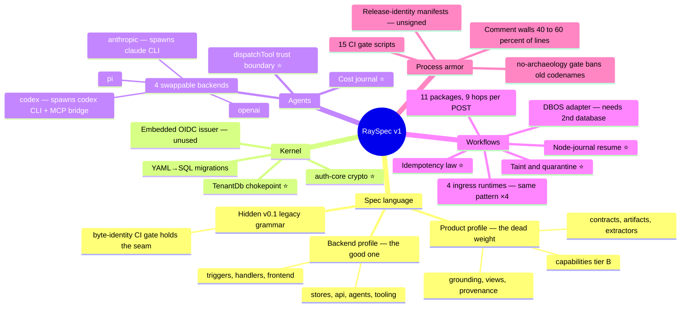

⭐ = crown jewel, ports to 2.0.

### I.2 By the numbers

| Metric | Value | Read |
|---|---|---|
| Workspace packages | 27 | for what deploys as **one server binary** |
| TypeScript LOC | ~91k | ~46.5k of it in workflow + capability packages alone |
| Docs | 6,111 lines | spec-reference alone is 2,571 lines |
| CI gate scripts | 15 (~8.3k LOC incl. self-tests) | several police *documentation hygiene*, not user value |
| Release machinery | ~3,400 LOC | producing an **unsigned** manifest; `npm --provenance` from CI is 30 lines and signed |
| Flagship product example | 884-line YAML | header proudly states it "carries ZERO product-domain meaning" |
| Concepts before hello-world | ~100 | the market bears ~15 |
| Env vars documented | 53 (716-line `.env.example`) | for a product pitched as "one file describes the deployment" |
| Steps to first authenticated curl | ~8 + self-supplied Postgres | tokens then expire in 8 minutes, mid-tutorial |

### I.3 What v1 got profoundly right — the crown jewels

These are expensive to get right twice. Port them, protect them, market them.

1. **The TenantDb chokepoint** (`kernel/db/tenant-db.ts`) — tenant scoping *by construction*:
   WHERE always AND-combined so callers can't drop the tenant filter, `update()` strips
   `tenant_id` from SET so rows can't change tenants, fail-closed on empty tenant ids,
   injected tenancy columns a user literally cannot forget. This is the eventual enterprise
   differentiator vs. Supabase's opt-in RLS that everyone botches.
2. **The tool-dispatch trust boundary** — every tool call from every backend funnels through
   one `dispatchTool` (validate-in → idempotency → timeout → validate-out → journal), so
   untrusted content is data, never instructions.
3. **The durability trio** — entity-scoped idempotency (blind client retries collapse to one
   run), node-granularity journal resume in the app's own Postgres, and the
   non-idempotent-tool **taint/quarantine** invariant (a crashed run that already fired
   `charge_card` is never silently re-fired). Most indie durable-workflow tools get this wrong.
4. **Error-message craft** — fail-closed grammar, *all* violations reported in one pass with
   JSON paths and closed codes, targeted hints ("wrap `1.0` in quotes"). Best-in-class, and
   the reason an LLM can author a spec convergently.
5. **The offline loop** — `init → doctor → plan` shows real migration SQL with zero DB and
   zero setup. The best 60 seconds of the product.
6. **auth-core crypto** — argon2id, rotating session families with reuse detection,
   timing-safe compares, the `isSensitive()` live-recheck split. Textbook-correct.
7. **Per-run cost journaling** with provider-vs-computed reconciliation — the hard 80% of
   usage-based AI billing, already built (then never exposed).
8. **Zero-infra realtime** — the Postgres-backed tenant event bus + `GET /v1/subscribe` SSE.

### I.4 Where it went wrong — four failure patterns

Every over-engineering finding in the audit reduces to one of these:

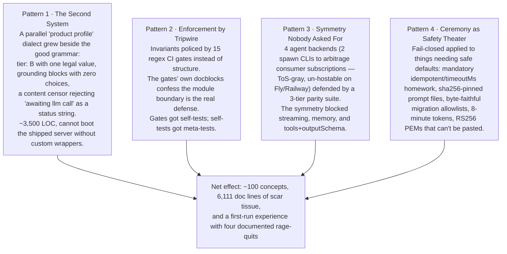

The comment walls (40–60% of kernel lines), the 300-word `package.json` script essays, and
the 250-line changelog entries are not a writing problem — **every essay is scar tissue over
a behavior too complex to state plainly**. Simplify the behavior and the prose collapses.

### I.5 The keep / simplify / kill / rebuild matrix

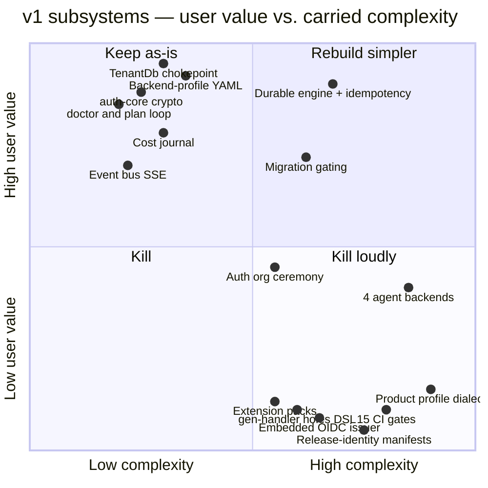

**The full verdict table** (consolidated from the seven subsystem audits):

| Subsystem | Verdict | 2.0 disposition |
|---|---|---|
| Backend-profile grammar (stores/api/agents/tooling/triggers/handlers/frontend) | ✅ **KEEP** | Becomes the *only* grammar; gains search, expand, defaults, env section |
| TenantDb chokepoint | ✅ **KEEP** | Port verbatim minus gate hooks; add Postgres RLS as the structural second layer |
| auth-core crypto (sessions, tokens, argon2id, email normalization) | ✅ **KEEP** | Port; add the missing flows (reset, social, magic links) on top |
| dispatchTool trust boundary | ✅ **KEEP** | Now structural: exactly one call site in the one owned loop |
| Durable engine (journal resume, idempotency law, taint/quarantine) | ✅ **KEEP** | One package; quarantine gets a visible dead-letter list + `redrive` verb |
| Cost/usage journal | ✅ **KEEP** | And finally *exposed*: `/v1/usage`, budgets, Stripe metering |
| Event bus + SSE subscribe | ✅ **KEEP** | Extended to carry agent token streaming |
| `doctor` / `plan` offline loop, `--check-env` | ✅ **KEEP** | check-env folds into deploy's failure output |
| Destructive-migration scanner + drift detection | 🔧 **SIMPLIFY** | Keep detection; replace byte-faithful allowlist files with interactive confirm + `--dev` mode |
| Org/membership model | 🔧 **SIMPLIFY** | Auto-create personal org at signup; kill the create/switch/re-mint ceremony |
| 4 ingress capability runtimes (16.5k LOC) | 🔧 **SIMPLIFY** | One ingress module in the server; audio's media pipeline is the only one earning a module |
| STT/TTS ports | 🔧 **SIMPLIFY** | One `transcribe()`, one `synthesize()` per provider |
| Handler escape hatch | 🔨 **REBUILD** | Plain TS file, esbuild-bundled at deploy, installable typed `@rayspec/sdk` |
| JSON-only CLI output | 🔨 **REBUILD** | Human-pretty by default, `--json` for machines/agents |
| Migration flow (4 hand-carried artifacts) | 🔨 **REBUILD** | `rayspec migrate` against a DB-stored baseline |
| DBOS adapter (2nd database, frozen vendor version) | 🔨 **REBUILD** | ~200-line SKIP LOCKED poller (or pg-boss) driving the one journal engine |
| Deploy pipeline registrar/verifier/sealer choreography | 🔨 **REBUILD** | One function: validate → migrate → register, in-process |
| Product-profile dialect (~3,500 LOC) | ❌ **KILL** | Its two earned features (file ingest, validated extraction) become workflow steps |
| pi + codex adapters; anthropic CLI-spawning adapter | ❌ **KILL** | One loop over Messages/Chat APIs; OpenAI-compatible = Gemini/OpenRouter/local for free |
| 3-tier parity suite, CapabilityDescriptor registry | ❌ **KILL** | Nothing left to keep symmetric |
| 13 of 15 CI gates + their meta-tests | ❌ **KILL** | Invariants move into `exports` maps + dependency-cruiser |
| Release-identity + publish ritual (~3,400 LOC) | ❌ **KILL** | 30-line CI workflow, `npm publish --provenance` — strictly more assurance, signed |
| Embedded OIDC *issuer* | ❌ **KILL** | Build OAuth *consumption* (Google/GitHub) — the exact inverse, and what users need |
| gen-handler holes-contract DSL | ❌ **KILL** | Claude writes the handler; ship a typed SDK + authoring skill instead |
| Extension packs (defineExtension, version pins) | ❌ **KILL** | Zero external users = zero pack authors; YAML `include:` covers reuse. Revisit post-traction |
| lintSuppress/because/stale_suppression governance | ❌ **KILL** | Warnings are ignorable; `suppress: [code]` list, done |
| no-archaeology / fixture-neutrality / skill-drift gates | ❌ **KILL** | A fresh repo has no archaeology; examples should be vivid, not neutrality-censored |
| Comment-wall register everywhere | ❌ **KILL** | Rationale moves to short ADR files; code states, docs teach |

### I.6 The v1 first-run journey (why people leave)

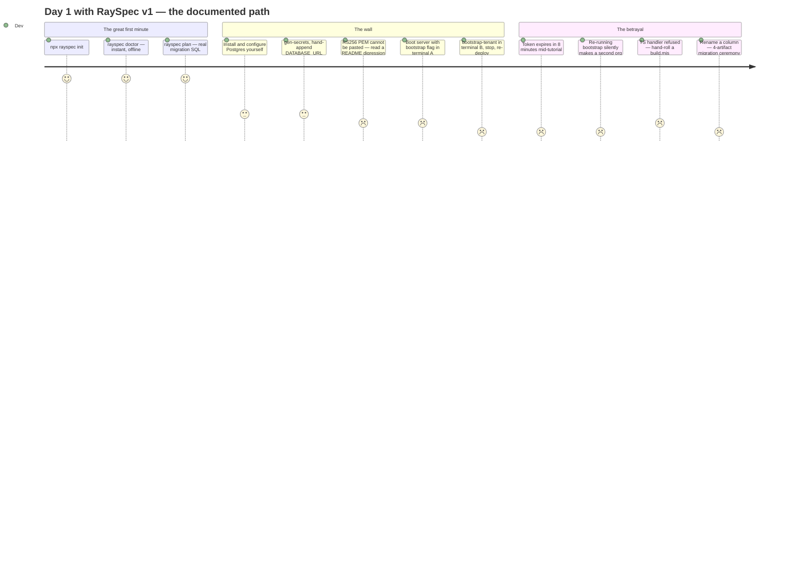

Four documented rage-quits. Every one of them is self-inflicted ceremony, not essential
complexity. Fixing this journey is worth more than any feature.

---

## Part II — The 2.0 Thesis

### II.1 Positioning: an empty quadrant with our name on it

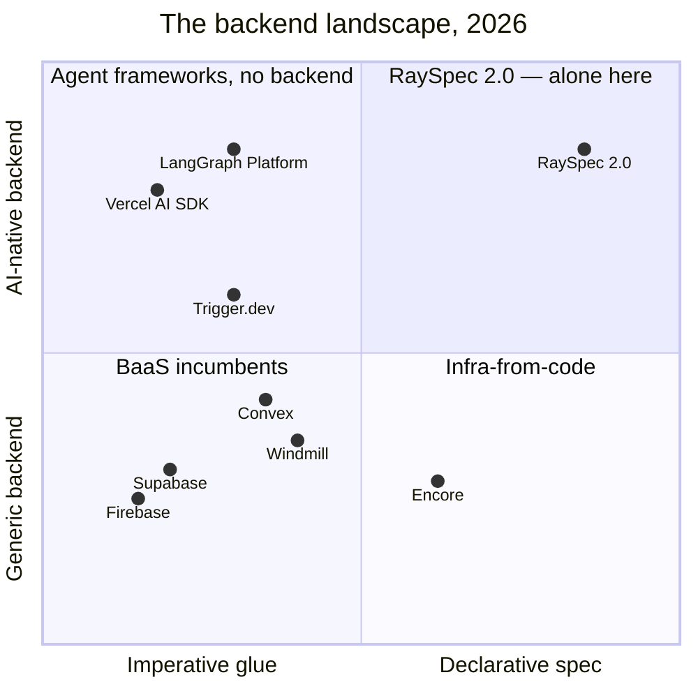

**The category: backend-as-a-spec for AI products.** Nobody owns "declare a complete
multi-tenant AI product in one reviewable, diffable, AI-writable file." The spec-as-artifact
has properties no competitor's onboarding flow can copy: it's the PR a reviewer can actually
read, the thing `plan` diffs into exact migration SQL, and the prompt target for coding agents.

**Honest competitive math.** Supabase beats us on hosting, dashboard, ecosystem — everywhere
except two things, which therefore become the whole pitch:

1. **Agents + durable workflows as first-class primitives** (Supabase makes you glue
   LangChain + Trigger.dev + queues yourself).
2. **Multi-tenancy you cannot get wrong** (structural chokepoint + injected columns vs.
   hand-rolled RLS policies).

> *"Supabase + Trigger.dev + an agent loop, in one file, that you can't screw up."*

### II.2 The customer is a pair: an indie hacker and their coding agent

The audit's sharpest insight: **v1 accidentally built the perfect product for an AI coding
agent.** The strict closed grammar, full-violation error lists with JSON paths, and
machine-readable CLI — every "over-engineered for humans" complaint is a *feature* for an LLM
authoring the spec. Claude cannot safely one-shot a Supabase project; it can absolutely
converge on a 100-line YAML against a validator that returns every violation at once.

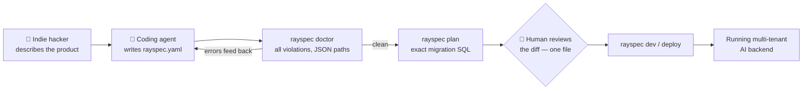

The buyer is the human; the heaviest user is their agent. 2.0 designs for both: pretty
human output by default, `--json` + an MCP server + a generated `agents.md` for the machine.

### II.3 The headline demo (and the metric)

**The demo:** the lead-qualifier — `POST` a lead → durable agent run → verdict persisted →
SSE update in a live UI. It's what indie AI builders hand-roll badly every week. In v1 this
demo exists (145 lines of YAML — genuinely great) but takes ~30 minutes and 8 env vars to run.

**The metric everything serves: time-to-wow ≤ 5 minutes.** Convex and Trigger.dev set that
bar. `npx rayspec new lead-qualifier && rayspec dev` must end with a working curl inside five
minutes on a laptop with nothing but Node and Docker installed.

---

## Part III — The 2.0 Design

### III.1 Seven concepts. That's the whole language.

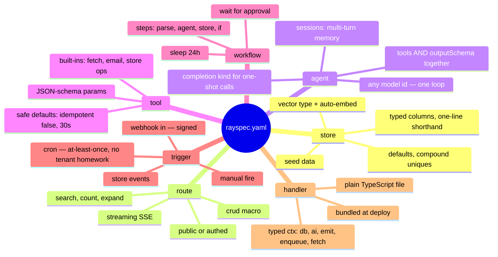

**Everything else is ambient** — you get it without declaring it: auth, orgs/tenancy,
injected columns, soft delete, rate limits, audit log, the event stream, usage metering.
And the litmus test for every future feature: *which of the seven words does it attach to?*
If it needs an eighth word, it ships as a template/recipe, not as grammar.

### III.2 Architecture: six modules where the boundaries ARE the security model

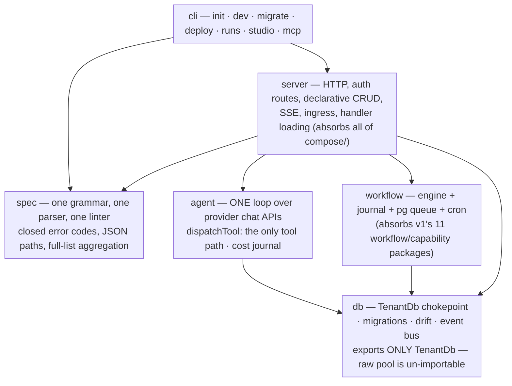

**The rule that deletes 13 of the 15 gate scripts:** enforce invariants with `package.json`
`exports` maps and one off-the-shelf boundary linter (dependency-cruiser), not regex tripwires.

| v1 gate (LOC) | 2.0 structural replacement |
|---|---|
| `check-tenant-chokepoint.mjs` (616) | `db` exports only `TenantDb`; the raw pool factory is un-importable. Nothing to scan. |
| `check-adapter-no-handlers.mjs` (603) | There are no adapters. One loop, one `dispatchTool` call site. |
| `check-handler-imports.mjs` (531) | The handler bundler resolves only `@rayspec/sdk` — one esbuild `external` config line. |
| byte-identity golden | One grammar. The seam it held shut no longer exists. |
| no-archaeology / skill-drift / fixture-neutrality | Deleted. Fresh repo, vivid examples, docs reviewed like code. |
| **`gate:migrations` destructive scan** | **Kept** — the one gate that guards user data. |

### III.3 Security by structure — three layers, stated once

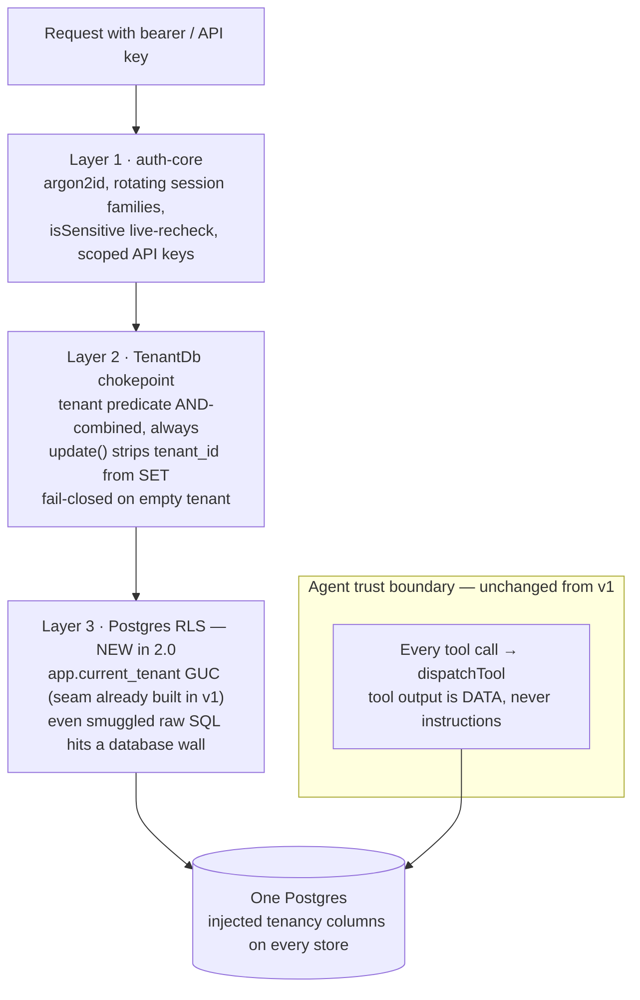

v1's own `deferrals.ts` names RLS as the missing layer and already built the GUC seam.
2.0 turns it on from the first migration. Fail-closed stays for production boots;
**empty-config dies** for dev (next section).

### III.4 The spec, before and after

**A notes app in 2.0 — 14 lines, no comments needed:**

```yaml
version: "2.0"
name: notes

stores:
  notes:
    title: string, required
    body: text
    pinned: bool, default false

api:
  notes: crud          # list (+search/count/expand) · get · create · update · delete

frontend:
  - { route: /, dir: web/dist, spa: true }
```

Tenancy, auth, timestamps, soft-delete, rate limits, SSE events, audit: **present, invisible**.
Two deliberate ergonomic bets: one-line column shorthand (v1's nested maps are YAML tax) and
the `crud` route macro (v1's `init` scaffolds the same five routes longhand).

**An AI agent app in ~30 lines — demonstrating everything v1 forbids:**

```yaml
version: "2.0"
name: lead-qualifier

stores:
  leads:
    email: string, required, unique
    notes: text
    verdict: enum(qualified, nurture, reject)
    reasoning: text

agents:
  qualifier:
    model: claude-sonnet-4-5        # any model id — or gpt-5, or an openai-compatible endpoint
    instructions: ./prompts/qualifier.md   # plain file. no sha256 pin homework.
    tools: [lookup_domain]
    outputSchema:                    # tools AND schema together — v1 rejects this
      verdict: enum(qualified, nurture, reject)
      reasoning: string

tools:
  lookup_domain:
    handler: ./handlers/enrich.ts    # TypeScript. bundled at deploy. no build.mjs.
    params: { domain: string }

api:
  leads: crud
  POST /leads/{id}/qualify:
    agent: qualifier
    async: true                      # 202 + runId · durable · journaled · cost-tracked
    persistTo: leads

triggers:
  - cron: "0 9 * * *"                # just runs. no RAYSPEC_CRON_TENANT_ID.
    agent: qualifier
```

Note what's load-bearing: tools **and** outputSchema together (the single most common agent
pattern, forbidden in v1), a model id instead of a backend enum, a plain prompt file, a TS
handler with no build step, a cron with no tenant plumbing, and no `idempotent`/`timeoutMs`
homework (safe defaults: `idempotent: false`, `timeout: 30s` — the *safe* direction, opt
*in* to replay). The durable-run semantics — journal, taint, dedup, cost — are unchanged
from v1. They just stopped being visible.

**Grammar upgrades ledger** (each closes an audited gap):

| Change | Closes |
|---|---|
| `search:` (ILIKE/FTS), `count`, offset paging on list routes | "search my notes" forcing a handler; FTS constants sat unused in v1's lint |
| `expand:` FK parents on reads | N+1 client calls |
| Column `default`, compound `unique`, `type: vector` | prototype walls |
| `env:` section declaring required vars | "file-deployable" being a lie while 53 vars live outside the file |
| `public: true` on routes | no unauthenticated hello-world; public landing APIs |
| `seed:` rows (dev-idempotent) | examples bootstrapping via curl |
| `include:` for spec composition | compiled-JS extension packs |
| Semver spec versions with additive-minor guarantees | `'1.0'` forever |
| `suppress: [code]` plain list | lintSuppress/because/stale_suppression bureaucracy |

### III.5 DX: `rayspec dev` is the whole day-1 story

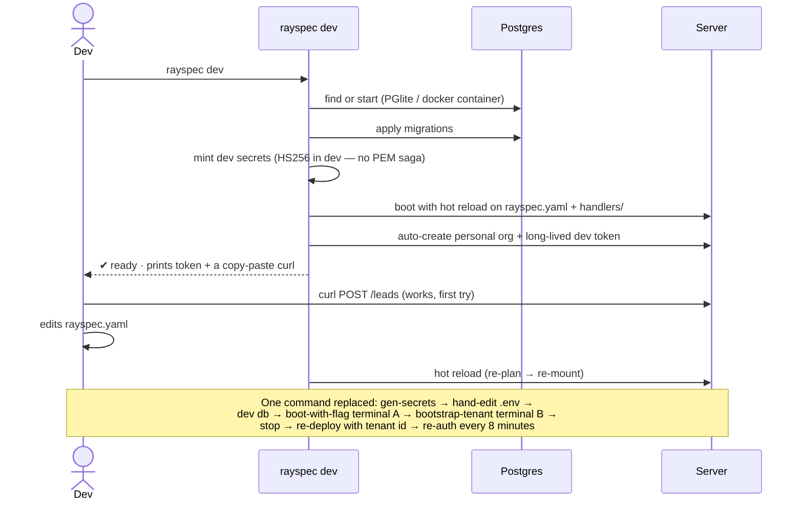

Also in the DX package:

- **Human output by default, `--json` for machines.** Keep the closed codes and exit-code
  contract underneath — they're the moat's machine-facing half.
- **One binary.** `rayspec serve` is a subcommand; the `rayspec`/`rayspec-serve` split dies.
- **No path jail.** A local CLI does not defend the user from their own filesystem.
- **Production stays strict**: fail-closed boot, `--check-env` knowledge folded into the
  failure message, ~3 required secrets (down from 53 documented vars).
- **Auth day-1**: signup auto-creates a personal org, tokens default to it, dev tokens are
  long-lived. *Multi-tenant-ready by construction, single-user by default.*

### III.6 Migration UX: `rayspec migrate` against a DB-stored baseline

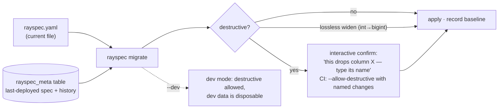

Keeps v1's three genuinely great pieces — deterministic YAML→SQL, the literal-aware
destructive scanner, report-only drift detection — and deletes the ceremony: no hand-carried
old-spec/new-spec/delta.sql/allowlist.json quartet, no byte-faithful whitespace-collapsed
matching, no flag you must remember to remove. Renaming a column on a 12-row prototype table
stops costing enterprise-migration tax.

### III.7 One agent loop instead of four backends

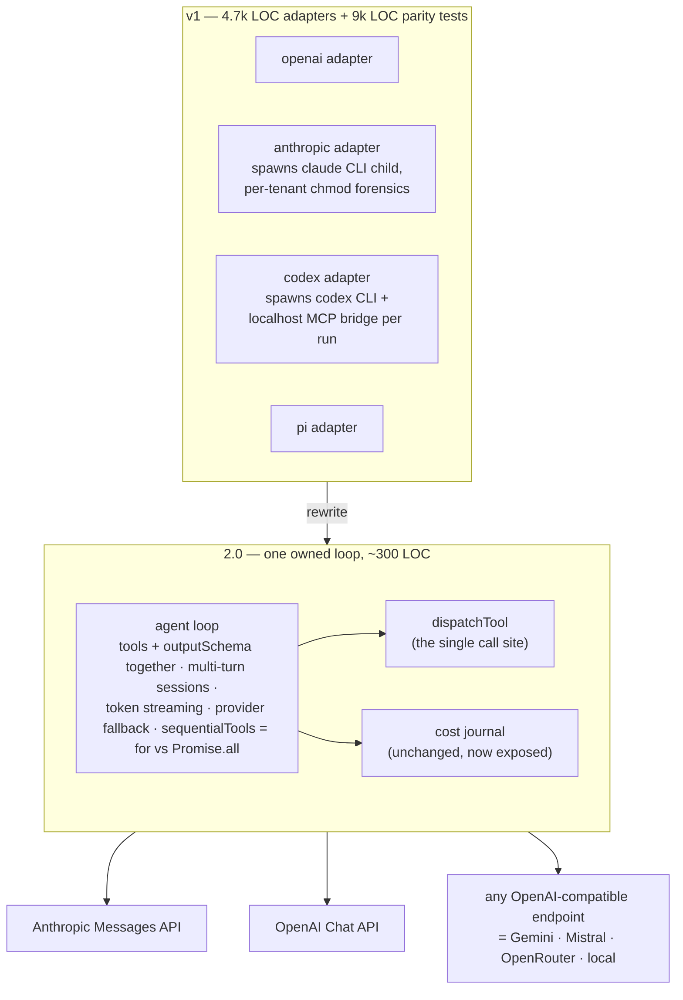

This one decision unblocks the top market asks the adapter zoo structurally blocked —
streaming, memory, tools+schema, fallback — and deletes the parity suite, the
CapabilityDescriptor registry, the auth-mode arbitrage subsystem, and the two
process-spawning adapters that made v1 un-hostable on Fly/Railway. Add a cheap
`kind: completion` for one-shot model calls that don't need the loop.

### III.8 Workflows: one engine, one queue, one database, five new verbs

**Keep** (proven, payable value): entity-scoped idempotency → one durable run per event;
node-granularity journal resume in the app's own Postgres; the taint/quarantine invariant.

**Delete**: DBOS (second database, frozen vendor version pinned by compiled-source line-number
assertions, at-most-once cron drop window) → a ~200-line `SKIP LOCKED` poller or pg-boss.
The 11 packages → 1. The 9-hop POST → ~3. The two dueling "HONEST DURABILITY CONTRACT"
essays → one contract. Statuses 9→5; failure policies fail/drop/quarantine/repair →
retry/fail/**dead-letter** (with a `redrive` exit — v1's quarantine was a dead-letter queue
with no door). Cron becomes at-least-once into idempotent enqueues — the run-id law already
dedupes, which deletes the crash-window essay.

**Add — the verbs users actually miss, in priority order:**

```yaml
workflows:
  refund-flow:
    trigger: { webhook: /hooks/refund-requested }   # webhook-in: v1 had 'RESERVED — fired by nothing'
    steps:
      - parse: pdf                                   # the product profile's one earned feature
      - agent: draft_refund                          # schema-validated extraction
      - wait_for: approval                           # 🆕 human-in-the-loop — parks the run,
                                                     #    approve/reject via API + Studio;
                                                     #    taint machinery makes resume safe
      - if: "{approved}"                             # 🆕 minimal branching
        then: { tool: issue_refund }
      - sleep: 24h                                   # 🆕 'follow up tomorrow'
      - agent: follow_up
```

"Agent drafts the refund, human clicks approve" is the most-requested pattern for agents that
touch money — and v1's taint work means 2.0 can offer it with a safety story competitors can't.
Linear + approval + delay covers 90% of real indie workflows; loops/fan-out wait.

---

## Part IV — New in 2.0: the complementary bets

Ranked by leverage-per-effort for a small team. The first four are each ≤ 2 weeks because
they mostly wrap machinery v1 already built.

| # | Feature | Class | The unlock |
|---|---|---|---|
| 1 | **`rayspec dev`** — embedded Postgres, dev token, hot reload | Table stakes | Deletes all four rage-quits. Nothing else matters if the first 5 minutes stay as they are |
| 2 | **AI round-trip**: `rayspec mcp` + generated `agents.md` | Differentiator | doctor/plan already speak machine; the authoring loop is ~1 week of wrapping. The 2026-native answer to a 2,571-line reference: the AI reads it for you |
| 3 | **Generated TS client + React hooks** (`rayspec gen client`) | Table stakes | The spec IR already has every type; "one YAML → typed full-stack app" becomes the demo |
| 4 | **Chat sessions + token streaming** (`session: true`, SSE reuse) | Table stakes | The #1 AI product shape, currently undeclarable |
| 5 | **`type: vector` + declarative RAG** (pgvector, `embed:`, `op: search`) | Differentiator | *Tenant-safe RAG in 6 lines of YAML* — injected tenancy means it cannot leak across tenants by construction. That's a launch tweet |
| 6 | **`rayspec studio`** — local dashboard over the journals | Differentiator | Runs list, step traces, cost per run/tenant, dead-letter + redrive button, data browser, live event tail. A read layer over tables v1 already writes |
| 7 | **Deploy targets**: `rayspec deploy --target docker\|fly\|railway` | Table stakes | Dockerfile + config emitted from `--check-env`'s existing knowledge. Hosted cloud comes later — don't build the control plane before the framework has users |
| 8 | **Usage metering + billing hooks**: `/v1/usage`, `limits: {monthlyCost}`, Stripe meter emitter | Differentiator | v1 built the hard 80% of AI usage billing and exposed none of it. Every indie AI product needs "don't lose money per free user" |
| 9 | **Outbound verbs**: `webhooks:` out (signed, durable retries), `email:` (Resend/SES), rate-limited `fetch` tool with domain allowlist | Table stakes | v1 cannot call the outside world — invites can't even be delivered. Without outbound, apps are terrariums |
| 10 | **`wait_for: approval` + `sleep:`** in workflows | Differentiator | See III.8 — the safety story competitors can't tell |
| 11 | **`rayspec migrate` + `seed:`** | Table stakes | See III.6 |
| 12 | **`rayspec new <template>`** — 6–8 vivid starters | Table stakes | Templates are the funnel, the recipe layer replacing the product profile, and the corpus the AI-authoring loop learns from |
| 13 | **Auth completeness**: Google/GitHub login, password reset, magic links, email verification, one themeable hosted `/login` page | Table stakes | Currently unshippable for any consumer app: no reset flow exists at all |
| 14 | **`rayspec eval`** over recorded runs | Later | The journal is already an eval corpus; keep its schema stable so this stays a read-side feature. Same bucket: plugin packs, multi-node rate limiting, hosted control plane |

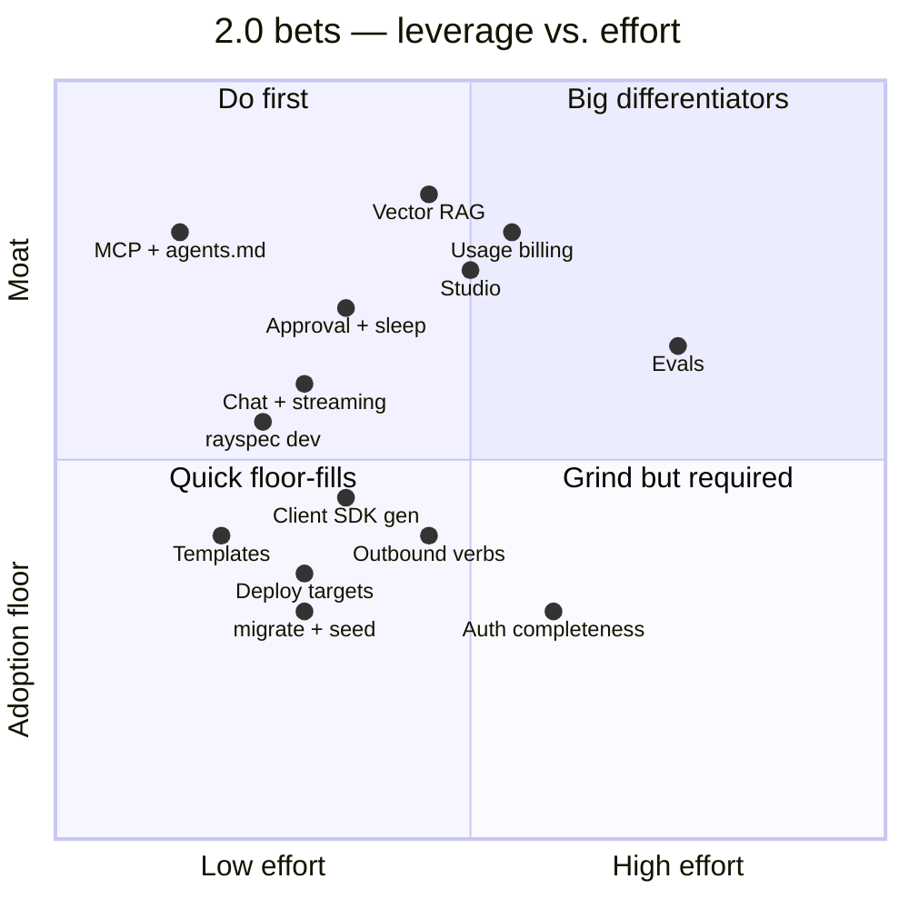

**The example gallery IS the roadmap.** Ship five vivid starters, delete the ten synthetic
fixtures (the 884-line "domain-neutral" YAML was a conformance test cosplaying as an example):

1. **Notes + UI** — 14 lines, the hero-section YAML
2. **Lead qualifier** — the headline demo (exists, is great)
3. **Streaming support chat** — needs #4
4. **RAG over uploaded PDFs** — needs #5
5. **Stripe webhook → workflow → email** — needs #9 and webhook-in

Three of five require features v1 doesn't have. That's the tell that the example list is the
real feature spec.

---

## Part V — Sequencing

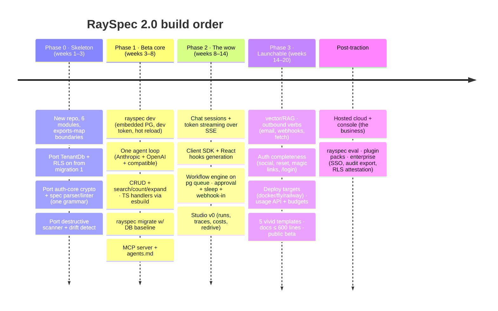

**Open-core split** (the business model, decided now so architecture doesn't fight it later):
the spec, runtime, TenantDb, agent loop, and workflow engine stay source-available — the
security-by-construction story only sells if inspectable. Paid: **RaySpec Cloud**
(`rayspec deploy --cloud`, managed Postgres, $19–49/mo indie pricing — "deploy" currently
means a foreground process on a laptop, and hosting is also the missing deploy story, so it's
product AND revenue) and the **hosted console** (runs viewer, agent traces, cost metering —
CFO-legible AI spend). Enterprise later: SSO, audit export, GDPR erasure attestation. What
carries to that future: the chokepoint+RLS, the crypto, the cost journal. What doesn't:
gates, manifests, comment walls — enterprises buy SOC 2 reports and RLS, not regex tripwires.

---

## Part VI — Anti-goals: what 2.0 deliberately does NOT build

Written down so scope drift has to argue with a document.

1. **No second grammar, ever.** New capability = new field on one of the seven concepts, or
   it's a template.
2. **No backend adapter zoo.** New models arrive via OpenAI-compatible endpoints, not new
   adapters. No subscription-billing arbitrage — a paid product can't rest on a loophole a
   vendor revokes by email.
3. **No plugin/extension system** until external users exist to author plugins.
4. **No bespoke codegen DSLs** (gen-handler holes). The AI writes handlers against a typed SDK.
5. **No OIDC issuer, no custom policy engine, no per-resource ACLs** in v2.0 — three roles +
   scoped API keys, until real customers hit the wall.
6. **No regex CI gates for architecture.** If an invariant needs a gate, the structure is
   wrong — fix the structure.
7. **No release rituals.** CI publishes with provenance or it doesn't publish.
8. **No comment walls.** Rationale lives in short ADRs; a file that needs a 70-line header to
   justify itself needs a redesign instead.
9. **No dashboard/hosting arms race with Supabase.** Studio stays a focused read layer over
   our own journals; hosting starts as emitted Dockerfiles.
10. **No enterprise ceremony before enterprise customers.** "Enterprise later" never again
    justifies present complexity that repels the casual users needed first.

---

## Part VII — Guardrails: how 2.0 stays simple

The audit's meta-lesson: v1's docs are the architecture test read back as pain. Make the
budgets the acceptance gates:

| Budget | Limit | Enforcement |
|---|---|---|
| User-facing concepts | 7 grammar words + ~15 total named ideas before hello-world | Any 8th word triggers a design review, not a doc page |
| Reference docs | ≤ 600 lines total | A feature whose honest documentation blows the budget gets redesigned before it gets documented |
| Quickstart | ≤ 100 lines, ≤ 5 minutes wall-clock | Timed in CI against a clean container |
| Error codes | ~20 (v1: ~56) | New code requires retiring one or a design review |
| Modules | 6 | New package = founder sign-off |
| Time-to-wow | ≤ 5 min from `npx rayspec new` to working curl | The north-star metric; measured, not vibed |
| Comment density | Code states *what*; ADRs state *why*; nothing argues with hypothetical reviewers | Review culture |

And the one cultural rule worth importing from v1 unchanged: **intellectual honesty.**
v1's docs saying "this is a tripwire, not a proof" and "what v1 does not do yet" is rare and
valuable. 2.0 keeps the honesty and loses the anxiety.

---

## Part VIII — Questions for you (steering input welcome)

1. **Name & repo**: fresh repo (`rayspec2` / new name?) with v1 archived, per "build fresh
   from scratch" — confirm?
2. **License**: keep FSL-1.1-ALv2, or MIT the core to maximize adoption and keep the cloud
   as the moat?
3. **The audio pipeline**: v1's audio ingest (upload/remux/playback tokens/STT) is the one
   ingress that earns its complexity. Is voice a 2.0 launch scenario for you, or does it
   ship post-beta? (The blueprint assumes post-beta.)
4. **PGlite vs. Docker Postgres for `rayspec dev`**: PGlite is zero-dependency magic but
   diverges from prod Postgres (no pgvector parity yet); Docker is true-to-prod but needs
   Docker installed. Recommendation: Docker-first with PGlite fallback — but this shapes
   week 1.
5. **Hosted cloud timing**: the blueprint says post-traction. If you want revenue pressure
   earlier, Phase 3 could swap deploy-targets for a minimal managed offering — trade-off is
   ~6 weeks of control-plane work before public beta.
6. **v1 migration**: is there any real v1 deployment whose spec must auto-convert, or is a
   documented manual mapping (v1 backend profile → 2.0 grammar is ~mechanical) enough?

---

*Compiled from a 10-agent audit of the v1 codebase: seven subsystem deep-reads (spec surface,
CLI/DX, kernel, agents/adapters, workflows/capabilities, examples, repo process) and three
entrepreneur lenses (market & positioning, radical simplification, complementary bets).
Every LOC figure, file path, and quoted behavior above was verified against the v1 tree.*
